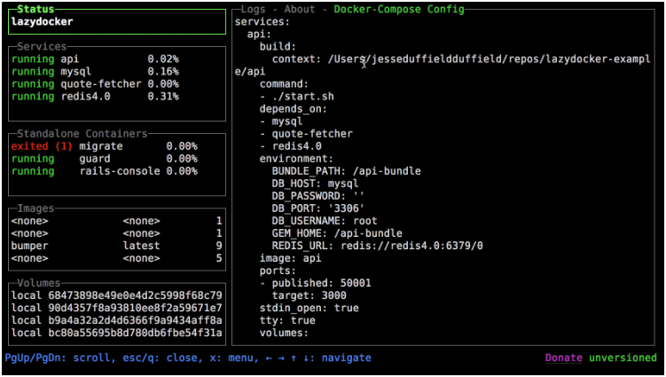

## Advanced Docker Workshop: Steer Your Code Ship!

Docker Crash Course

**Introduction:**

This training will provide an advanced hands-on study on topics such as known docker commands, docker-cli, dockerfile, image, container, docker compose. 

**Target Audience:**

Software developers, AI Engineers, DevOps Engineers, System Administrators, and anyone interested in learning advanced Docker concepts.

**Workshop Content:**

**1. Common Docker Commands and docker-cli:**

* **Docker CLI Basics:** We'll cover the essential Docker CLI commands that every developer should know.

    * **Examples:** Using the Docker CLI, we can manage images, containers, networks, and volumes.

    ```bash
    # List all Docker images
    docker images

    # Pull an image from Docker Hub
    docker pull <image_name>

    # Run a container from an image
    docker run -d --name my-container <image_name>

    # List all containers
    docker ps
    docker ps -a
    
    # Stop a running container
    docker stop my-container

    # Remove a container
    docker rm my-container

    # Remove an image
    docker rmi <image_name>
    ```

    * **Best Practice:** Familiarize yourself with the Docker CLI to efficiently manage your Docker environment and streamline your development workflow.

    * **Bonus**: [lazydocker](https://github.com/jesseduffield/lazydocker)
    


---
**1. Advanced Image Management:**

*   **Simple Dockerfile:** We'll dissect a Dockerfile to understand its structure and the commands used to build images.

    *   **Example:** When building a Python application image, we can use a Dockerfile to define the base image, copy the application code, install dependencies, and specify the command to run the application.

    
    Dockerfile:
    ```dockerfile
    FROM python:3.9-slim
    WORKDIR /app
    COPY . .
    RUN pip install -r requirements.txt
    CMD ["python", "app.py"]
    ```

    crash commands :)
    ```bash
    $build: docker build -t app .
    
    $run: docker run app

    $list: docker ps

    $connect: docker exec -it container-id /bin/bash
    ```


    *   **Best Practice:** Organize your Dockerfile commands efficiently to optimize the image build process and minimize image size.

---
*   **Multi-stage builds:** We'll deeply explore multi-stage build techniques to minimize image size and craft more optimized images.

    *   **Real-World Example:** When building a Java application image, we'll use a Maven image in the first stage to handle the application's build process. In the second stage, we'll employ a smaller JRE image and copy only the necessary files. This significantly reduces the image size.

    ```dockerfile
    # Stage 1: Build
    FROM maven:3.8.4-openjdk-11 AS build
    WORKDIR /app
    COPY pom.xml .
    COPY src ./src
    RUN mvn clean package

    # Stage 2: Production
    FROM openjdk:11-jre-slim
    WORKDIR /app
    COPY --from=build /app/target/myapp.jar /app/myapp.jar
    CMD ["java", "-jar", "/app/myapp.jar"]
    ```

    *   **Best Practice:** When using multi-stage builds, consider employing different base images for each stage. For instance, you might use a larger image for the build stage and a smaller one for the final image.

*   **Image layers and optimization:** We'll dissect how image layers function and strategies to minimize image size.

    *   **Real-World Example:** By examining an image, we can use the `docker history` command to identify which layers occupy how much space and which files have been modified. This allows us to eliminate unnecessary files or merge layers to optimize image size.

    ```bash
    docker history mongo
    ```

    Example output:
    ```plaintext
    IMAGE          CREATED        CREATED BY                                      SIZE      COMMENT
    72576a3db032   5 months ago   CMD ["mongod"]                                  0B        buildkit.dockerfile.v0
    <missing>      5 months ago   EXPOSE map[27017/tcp:{}]                        0B        buildkit.dockerfile.v0
    <missing>      5 months ago   ENTRYPOINT ["docker-entrypoint.sh"]             0B        buildkit.dockerfile.v0
    <missing>      5 months ago   COPY docker-entrypoint.sh /usr/local/bin/ # …   14.2kB    buildkit.dockerfile.v0
    <missing>      5 months ago   ENV HOME=/data/db                               0B        buildkit.dockerfile.v0
    <missing>      5 months ago   VOLUME [/data/db /data/configdb]                0B        buildkit.dockerfile.v0
    <missing>      5 months ago   RUN |2 MONGO_PACKAGE=mongodb-org MONGO_REPO=…   769MB     buildkit.dockerfile.v0
    <missing>      5 months ago   ENV MONGO_VERSION=8.0.0                         0B        buildkit.dockerfile.v0
    <missing>      5 months ago   RUN |2 MONGO_PACKAGE=mongodb-org MONGO_REPO=…   116B      buildkit.dockerfile.v0
    <missing>      5 months ago   ENV MONGO_MAJOR=8.0                             0B        buildkit.dockerfile.v0
    <missing>      5 months ago   ENV MONGO_PACKAGE=mongodb-org MONGO_REPO=rep…   0B        buildkit.dockerfile.v0
    <missing>      5 months ago   ARG MONGO_REPO=repo.mongodb.org                 0B        buildkit.dockerfile.v0
    <missing>      5 months ago   ARG MONGO_PACKAGE=mongodb-org                   0B        buildkit.dockerfile.v0
    <missing>      5 months ago   RUN /bin/sh -c mkdir /docker-entrypoint-init…   0B        buildkit.dockerfile.v0
    <missing>      5 months ago   RUN /bin/sh -c set -eux;   savedAptMark="$(a…   3.02MB    buildkit.dockerfile.v0
    <missing>      5 months ago   ENV JSYAML_VERSION=3.13.1                       0B        buildkit.dockerfile.v0
    <missing>      5 months ago   ENV GOSU_VERSION=1.17                           0B        buildkit.dockerfile.v0
    <missing>      5 months ago   RUN /bin/sh -c set -eux;  apt-get update;  a…   5.13MB    buildkit.dockerfile.v0
    <missing>      5 months ago   RUN /bin/sh -c set -eux;  groupadd --gid 999…   4.73kB    buildkit.dockerfile.v0
    <missing>      5 months ago   /bin/sh -c #(nop)  CMD ["/bin/bash"]            0B        
    <missing>      5 months ago   /bin/sh -c #(nop) ADD file:6f881131af38dde06…   78.1MB    
    <missing>      5 months ago   /bin/sh -c #(nop)  LABEL org.opencontainers.…   0B        
    <missing>      5 months ago   /bin/sh -c #(nop)  LABEL org.opencontainers.…   0B        
    <missing>      5 months ago   /bin/sh -c #(nop)  ARG LAUNCHPAD_BUILD_ARCH     0B        
    <missing>      5 months ago   /bin/sh -c #(nop)  ARG RELEASE                  0B        
    ```

    **Interpreting the Output:**
    - Each line represents a layer in the Docker image.
    - The `CREATED BY` column shows the command that created the layer.
    - The `SIZE` column indicates the size of each layer.

    For example:
    - The largest layer (769MB) was created by the `RUN` command that installs MongoDB packages. This is a key area to focus on for optimization.
    - Layers with `0B` size indicate metadata changes or commands that do not add significant data (e.g., `CMD`, `EXPOSE`, `ENV`).

    **Optimization Tips:**
    - **Combine RUN Commands:** Merge multiple `RUN` commands into a single command to reduce the number of layers.
    - **Order of Commands:** Place frequently changing commands (e.g., `COPY` for application code) towards the end of the Dockerfile to leverage caching.
    - **Remove Unnecessary Files:** Clean up temporary files and package caches within the same `RUN` command to avoid adding extra layers.

    *   **Best Practice:** To optimize image layers, position frequently modified files in the lower layers and less frequently modified files in the upper layers. For example, in the MongoDB image, the largest layer is created by the `RUN` command that installs MongoDB packages, which occupies 769MB. By identifying such large layers, we can focus on optimizing or merging them to reduce the overall image size.

*   **Image security:** We'll focus on image scanning tools and methods to address security vulnerabilities.

    *   **Real-World Example:** Employing tools like Clair or Anchore Engine, we can scan our images to pinpoint security vulnerabilities and implement necessary precautions.

    *   **Best Practice:** Regularly scan your images to detect security vulnerabilities early and apply the latest security patches.

---
**1. Advanced Container Management:**

*   **Container lifecycle management:** We'll teach techniques to more efficiently manage container lifecycle processes, such as starting, stopping, restarting, and deleting containers.

    *   **Real-World Example:** When starting a web application container, we can use parameters like `--restart always` to ensure the container restarts automatically.

    ```bash
    docker run --restart always <image_name>
    ```

    *   **Best Practice:** Utilize orchestration tools like Docker Compose or Kubernetes to manage container lifecycles.

*   **Resource management:** We'll demonstrate how to allocate and limit resources like CPU, memory, and disk for containers.

    *   **Real-World Example:** By setting specific memory and CPU limits for a database container, we can prevent it from consuming excessive resources.

    ```bash
    docker run -m 512M --cpus="0.5" <image_name>
    ```

    *   **Best Practice:** By imposing resource limits on containers, we ensure efficient utilization of system resources and prevent them from impacting the performance of other applications.

*   **Container orchestration fundamentals:** We'll introduce orchestration tools like Kubernetes or Docker Swarm, covering basic concepts and usage scenarios.

    *   **Real-World Example:** Managing, scaling, and updating an application composed of multiple containers becomes effortless with Kubernetes or Docker Swarm.

    *   **Best Practice:** Leverage container orchestration to meet the high availability and scalability demands of your applications.

---
**1. Docker Networks and Security:**

*   **Network models:** We'll examine Docker's various network models (bridge, host, overlay) and discuss their usage scenarios.

    *   **Real-World Example:** We can use the bridge network to enable communication between different containers or the host network to allow a container to reside on the same network as the host machine.

    ```bash
    docker run --net bridge <image_name>
    docker run --net host <image_name>
    ```

    *   **Best Practice:** Select the network model that aligns with your application's requirements to optimize inter-container communication and security.

*   **Container communication:** We'll address how containers communicate with each other and how to ensure network security.

    *   **Real-World Example:** We can use Docker networks to facilitate communication between a web application container and a database container.

    *   **Best Practice:** Employ network policies and firewalls to secure inter-container communication.

*   **Security best practices:** We'll emphasize the measures and considerations needed to enhance Docker security.

    *   **Real-World Example:** By pulling Docker images from trusted sources, we can prevent unauthorized access and mitigate security vulnerabilities.

    *   **Best Practice:** To bolster Docker security, utilize image scanning tools, implement authorization mechanisms, and regularly apply security updates.

---
**1. Docker Volumes and Data Management:**

*   **Volume types:** We'll explore different volume types, such as bind mounts, Docker-managed volumes, and tmpfs volumes, and elucidate their usage scenarios.

    *   **Real-World Example:** We can use Docker-managed volumes to persistently store data for a database container.

    ```bash
    docker run -v my-volume:/data <image_name>
    ```

    *   **Best Practice:** Choose the volume type that aligns with your data persistence and performance needs to optimize data management.

*   **Data persistence:** We'll demonstrate how to preserve and make data persistent even when containers are deleted.

    *   **Real-World Example:** We can use bind mounts to store a web application's files on the host machine.

    ```bash
    docker run -v $(pwd)/app:/app <image_name>
    ```

    *   **Best Practice:** To ensure data persistence, regularly back up data and synchronize it across different environments.

*   **Data backup and restore:** We'll cover methods for backing up and restoring Docker volumes.

    *   **Real-World Example:** By regularly backing up the data of a database container, we can restore the data in case of data loss.

    *   **Best Practice:** Develop data backup and restore strategies to mitigate the risk of data loss and ensure business continuity.

---
**1. Docker Compose and Advanced Usage:**

*   **Compose file format:** We'll thoroughly examine the structure and features of Compose files.

    *   **Real-World Example:** We can define and manage an application consisting of multiple services using a single Compose file.

    ```yaml
    version: "3.9"
    services:
      web:
        image: nginx:alpine
        ports:
          - "80:80"
      db:
        image: postgres:14-alpine
        environment:
          POSTGRES_USER: myuser
          POSTGRES_PASSWORD: mypassword
    ```

    *   **Best Practice:** By using Compose files, we can easily define and manage the various services and dependencies of our application.

*   **Multi-environment management:** We'll demonstrate how to create and manage different Compose files for different environments (development, testing, production).

    *   **Real-World Example:** We can use a different Compose file for the development environment, a different one for the testing environment, and yet another for the production environment.

    *   **Best Practice:** To manage inter-environment differences, we can customize Compose files with environment variables.

*   **Complex applications with Docker Compose:** We'll illustrate how to easily spin up and manage complex applications composed of multiple services using Docker Compose.

    *   **Real-World Example:** We can easily bring up and manage an application with a microservices architecture using Docker Compose.

    *   **Best Practice:** Using Docker Compose, we can easily define and manage the different services and dependencies of our application.

---
**1. Docker and CI/CD Integration:**

*   **Integration with Jenkins, GitLab CI, or GitHub Actions:**

    *   **Real-World Example:** With every code change, we can automatically build and test an application, create a Docker image, and push it to Docker Hub.

    *   **Best Practice:** By using CI/CD pipelines, we ensure that our application is continuously integrated and tested, automate the deployment process, and detect errors early.

This comprehensive content, enriched with real-world examples and best practices, should serve as a valuable resource for your advanced Docker workshop. Remember to adapt the content and examples to best suit your audience's specific needs and interests.